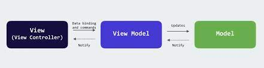
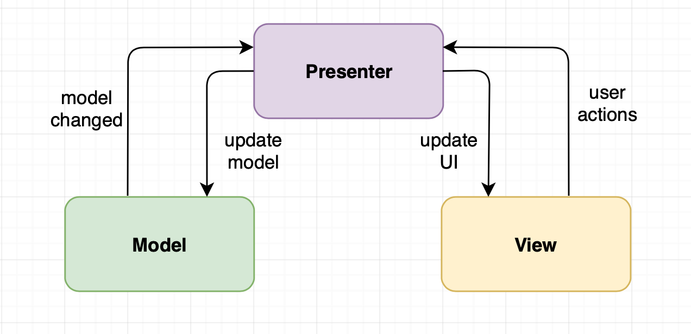

# Swift Design Patterns

as ios developer it's better to have practice of using these in day to day life.
you can find branches for each category.
in this repository we will be focusing on following design pattens.

1. MVVM - Model View ViewModel
2. MVP - Model View Presenter
3. Coordinator
4. VIPER - View Interactor Presenter Entity Router

## MVVM - Model View ViewModel

## MVP - Model View Presenter

